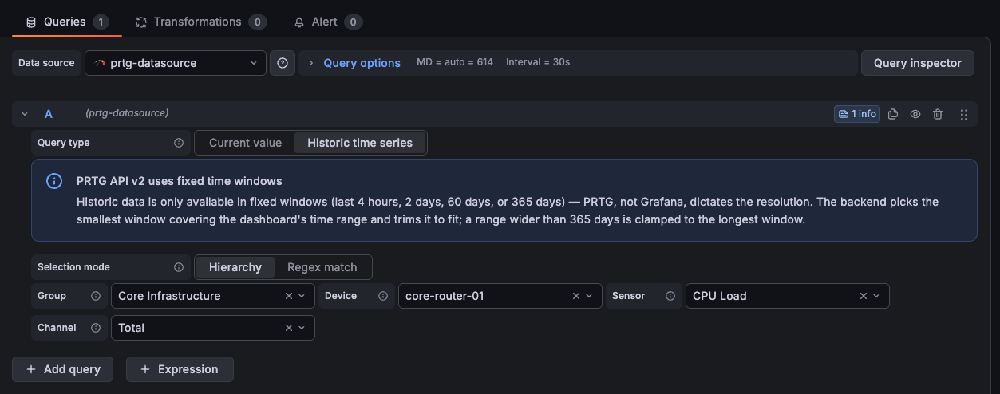
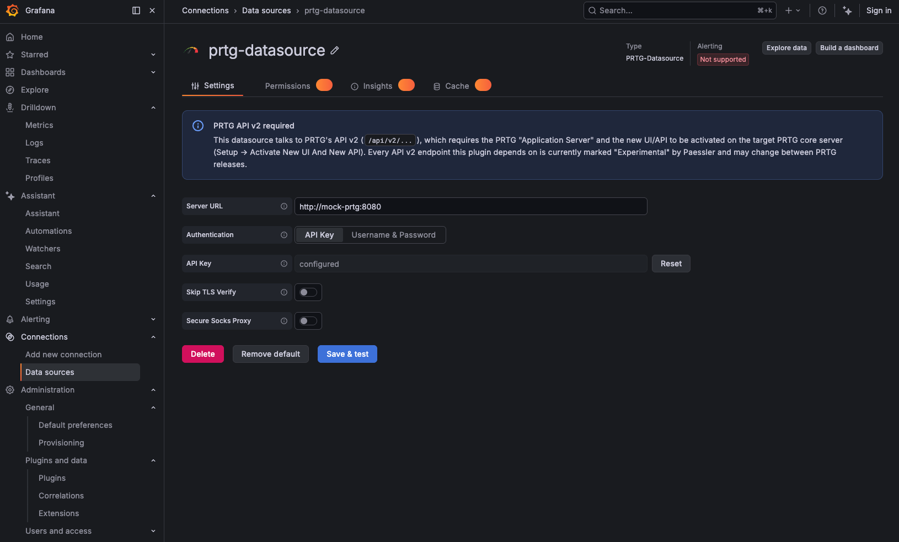
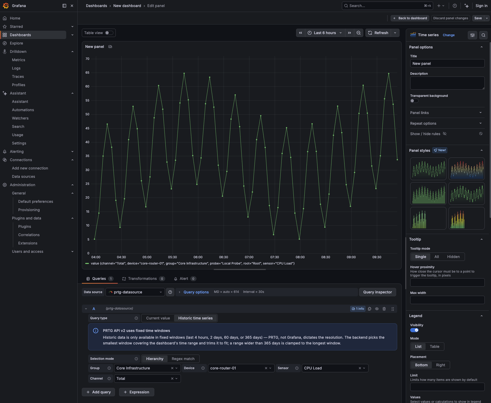
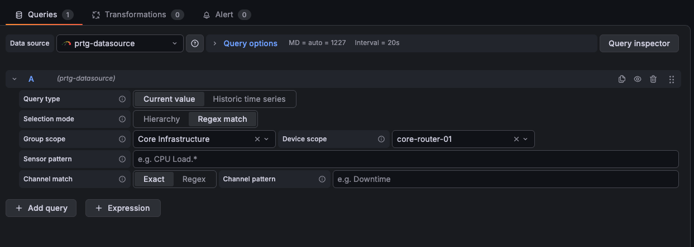

# PRTG Datasource for Grafana

Query and visualize [PRTG Network Monitor](https://www.paessler.com/prtg) sensor data directly in Grafana dashboards.

## What is PRTG?

[PRTG](https://www.paessler.com/prtg) is Paessler's all-in-one infrastructure monitoring platform. It polls thousands of **sensors** across your network — ping, CPU load, traffic, disk space, custom scripts, and hundreds of other sensor types — and keeps track of their current status and historic values.

## Why this datasource?

PRTG has its own UI and alerting, but most teams already run Grafana as their single pane of glass for dashboards, alerting, and on-call. This plugin lets you bring PRTG's monitoring data into that same workflow instead of maintaining it separately:

- **One dashboard for everything** — put PRTG sensors next to metrics from Prometheus, cloud providers, databases, and any other Grafana datasource.
- **Grafana-native alerting, templating, and sharing** on top of PRTG data, instead of PRTG's own, separate alerting.
- **Reach PRTG from Grafana Cloud, even in a private network** — via [Private Data Source Connect](https://grafana.com/docs/grafana-cloud/connect-externally-hosted/private-data-source-connect/), no inbound firewall access required.
- **A real backend plugin, not screen-scraping** — a Go backend talks to PRTG's own REST API (API v2), so it's fast and credentials never reach the browser.

## Features

- **Two query modes**: a *current value* snapshot, or a *historic time series* — PRTG's fixed time windows (4 hours / 2 days / 60 days / 365 days) are picked and stitched together automatically to fit whatever range your panel asks for.
- **Hierarchy picker**: cascading Group → Device → Sensor → Channel dropdowns for exact selection.
- **Regex match mode**: match many sensors and channels at once by pattern (scoped to a group/device), so dashboards keep working as your PRTG setup grows.
- **Two authentication modes**: PRTG API key, or username & password.
- **TLS skip-verify** option for PRTG servers with a self-signed certificate.
- **Grafana Cloud Private Data Source Connect (PDC)** support, for PRTG servers that aren't publicly reachable.

## Screenshots

**Historic time series query editor**:

 

 
more screenshots

**Datasource configuration** — server URL, authentication, TLS and secure-proxy options:

**Panel editor** — a historic time series query, picked via the Group → Device → Sensor → Channel hierarchy:

**Current value query editor**, in regex match mode:

 

## Requirements

- Grafana **12.3.0** or later.
- PRTG with the **Application Server / new UI and API v2** activated (*PRTG Setup → Activate New UI And New API* — on by default from PRTG 25.2.106 onward). Every API v2 endpoint this plugin depends on is currently marked "Experimental" by Paessler and may change between PRTG releases.

## Getting started

1. Install the plugin and add a new **PRTG-Datasource** in Grafana.
2. Set the **Server URL** of your PRTG core server and choose an authentication mode (API key, or username & password).
3. In a panel, pick a query type — *Current value* or *Historic time series* — and select a sensor/channel via the hierarchy picker, or switch to regex match mode to target many at once.

## Useful links

- [PRTG API v2 overview](https://www.paessler.com/support/prtg/api/v2/overview/index.html) — the REST API this plugin talks to.
- [PRTG manual](https://www.paessler.com/manuals/prtg) — Paessler's full PRTG documentation.
- [Grafana Private Data Source Connect](https://grafana.com/docs/grafana-cloud/connect-externally-hosted/private-data-source-connect/) — connecting Grafana Cloud to a PRTG server in a private network.
- [CHANGELOG](CHANGELOG.md)

## Development

Building, testing, and running this plugin locally (including a mock PRTG server for development without a real PRTG instance) is covered in [DEVELOPMENT.md](DEVELOPMENT.md).

## License

[Apache License 2.0](LICENSE)
